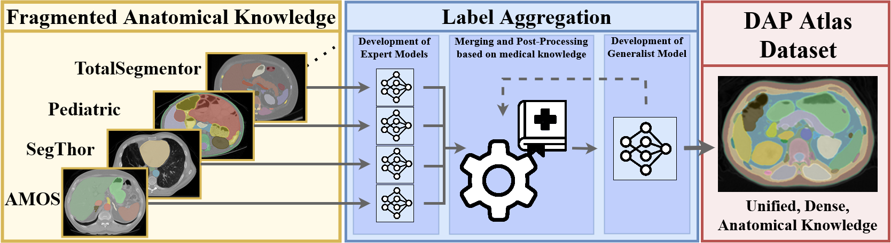
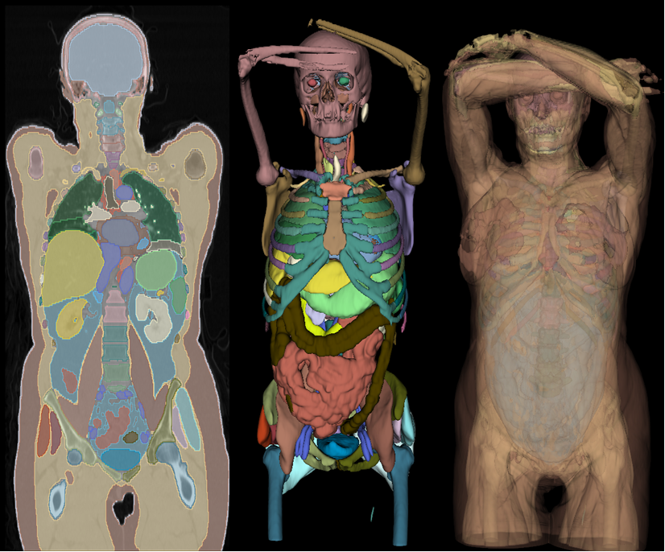
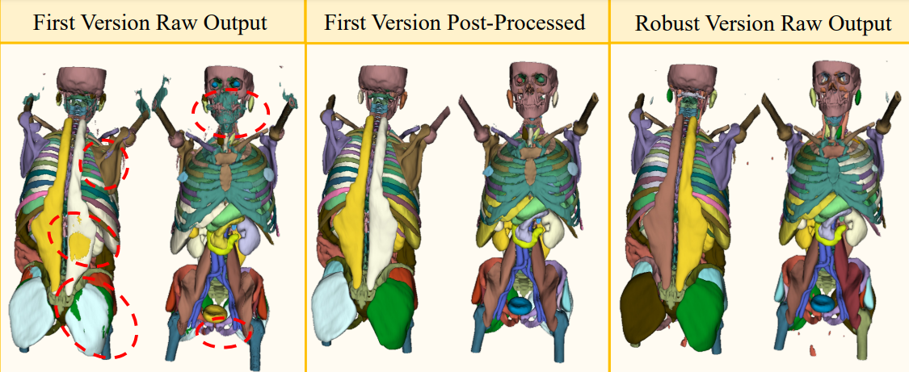

<div align="center">

# Towards Unifying Anatomy Segmentation: Automated Generation of a Full-body CT Dataset

</div>

<p align="center">
<a href=https://arxiv.org/abs/2307.13375></a>
<a href="https://drive.google.com/drive/folders/1WIlvpeKAWNS99sFprkGKtNZkHm-3agLf?usp=sharing"></a>
<a href="https://www.synapse.org/#!Synapse:syn52287632.1/datasets/"></a>
</p>

## Introduction
To tackle anatomical segmentation as a whole, we create the **DAP (Dense Anatomical Prediction) Atlas Dataset** which is constructed by aggregating multiple, fragmented source datasets which only show subparts of the anatomy. These datasets are merged into a single full-body dataset by leveraging anatomical guidelines. 



## Atlas Dataset

The Atlas Dataset utilizes the recently introduced [AutoPET](https://wiki.cancerimagingarchive.net/pages/viewpage.action?pageId=93258287) dataset and offers comprehensive anatomical masks for 533 CT scans from this dataset. These masks cover 142 distinct anatomical structures, facilitating the development of anatomical segmentation models for diverse downstream applications.

### Dataset Usage
Download the provided [DAP Atlas annotation masks](https://drive.google.com/file/d/1ex0a9eQULLvKPDwijmijX2h49A-ockNy/view?usp=drive_link) and the [AutoPET CT images](https://wiki.cancerimagingarchive.net/pages/viewpage.action?pageId=93258287). The CTs and the Atlas masks can be uniquely matched via their file names.

```text
ATLAS_DATASET
├── AutoPET_0011f3deaf_10445.nii.gz
├── AutoPET_01140d52d8_56839.nii.gz
├── AutoPET_0143bab87a_33529.nii.gz
└── ...
```
The given name consists of the subject ID followed by the last 5 digits of the Study UID which allows a unique matching of the segmentation masks to the AutoPET CTs.




## Anatomical Prediction Models
Our dataset generation approach relies on training numerous models, which is why we rely on the [nnU-NetV1](https://github.com/MIC-DKFZ/nnUNet/tree/nnunetv1).

Besides the dataset, we publish two anatomical models which are trained nnU-netsV1:
- **The Atlas dataset model (V1):** This network was trained in the standard nnU-Net fashion and was used to generate the raw dataset which has to be post-processed.

- **The Atlas prediction model (V2):** The network is trained according to a custom training schedule. It predicts the anatomy more reliably and offers a performance similar to the post-processed V1 model.



Unless there exists a specific reason, we recommend the usage of the Atlas prediction model (V2) for anatomical prediction tasks.

### Model SetUp and Inference
Follow the instructions to install the [nnU-Net**V1**](https://github.com/MIC-DKFZ/nnUNet/tree/nnunetv1) version. Download our provided anatomical segmentation models, unpack them and move them to the `RESULTS` folder of the nnU-Net. Your data structure should look like this.

```text
RESULTS_FOLDER/nnunet
├── 2d
├── 3d_cascade_fullres
├── 3d_fullres
│   ├── Task901_Atlas_Dataset
│   │   └── nnUNetTrainerV2__nnUNetPlansv2.1
│   │       ├── fold_0
│   │       ├── fold_1
│   │       ├── fold_2
│   │       ├── fold_3
│   │       └── fold_4
│   └── Task902_Anatomy_Prediction
│       ├── nnUNetTrainerV2__nnUNetPlansv2.1
│       │   ├── fold_0
│       │   ├── fold_1
│       │   ├── fold_2
│       │   ├── fold_3
│       │   └── fold_4
│       └── nnUNetTrainerV2_noMirroring__nnUNetPlansv2.1
│           ├── fold_0
│           ├── fold_1
│           ├── fold_2
│           ├── fold_3
│           └── fold_4
└── 3d_lowres

```
Inference can be performed with the models using the nnU-Net pipeline. For the Atlas prediction model (V2), test-time augmentation has to be disabled.

```python
# Perform inference with the Atlas prediction model (V2)
nnUNet_predict -i INPUT_FOLDER -o OUTPUT_FOLDER -t 902 -m 3d_fullres -chk model_latest -tr nnUNetTrainerV2_noMirroring --disable_tta

# Perform inference with the Atlas dataset model (V1)
nnUNet_predict -i INPUT_FOLDER -o OUTPUT_FOLDER -t 901 -m 3d_fullres 
```
`INPUT_FOLDER` denotes the directory which contains the CTs, and `OUTPUT_FOLDER` described the target directory to which the predictions will be written.
## Post Processing
We provide the code to perform the described post-processing operations of the raw output model predictions to improve their quality by leveraging medical guidelines. The script can be started by using the following command:

```python
python post_processing/post_process_volumes.py --source_dir INPUT_FOLDER --target_dir PP_OUTPUT --nof_jobs NOF_JOBS
```
You can specify an input directory `INPUT_FOLDER` in which atlas predictions are stored and the target directory `PP_OUTPUT` describes the directory to which the post-processed labels will be saved. `NOF_JOBS` specifies how many jobs will be used in parallel to process the input directory. Each job will process one file.

## Citations
If you make use of our dataset or anatomical predictions models, please cite our work:
```
@article{jaus2023towards,
  title={Towards Unifying Anatomy Segmentation: Automated Generation of a Full-body CT Dataset via Knowledge Aggregation and Anatomical Guidelines},
  author={Jaus, Alexander and Seibold, Constantin and Hermann, Kelsey and Walter, Alexandra and Giske, Kristina and Haubold, Johannes and Kleesiek, Jens and Stiefelhagen, Rainer},
  journal={arXiv preprint arXiv:2307.13375},
  year={2023}
}
```
Furthermore, consider citing the following works, as they are the cornerstones of this project:

#### nnU-Net 

```
@article{isensee2021nnu,
  title={nnU-Net: a self-configuring method for deep learning-based biomedical image segmentation},
  author={Isensee, Fabian and Jaeger, Paul F and Kohl, Simon AA and Petersen, Jens and Maier-Hein, Klaus H},
  journal={Nature methods},
  volume={18},
  number={2},
  pages={203--211},
  year={2021},
  publisher={Nature Publishing Group US New York}
}
```

#### AutoPet

```
@article{gatidis2022whole,
  title={A whole-body FDG-PET/CT Dataset with manually annotated Tumor Lesions},
  author={Gatidis, Sergios and Hepp, Tobias and Fr{\"u}h, Marcel and La Foug{\`e}re, Christian and Nikolaou, Konstantin and Pfannenberg, Christina and Sch{\"o}lkopf, Bernhard and K{\"u}stner, Thomas and Cyran, Clemens and Rubin, Daniel},
  journal={Scientific Data},
  volume={9},
  number={1},
  pages={601},
  year={2022},
  publisher={Nature Publishing Group UK London}
}
```